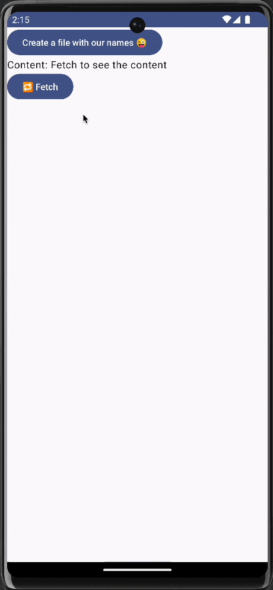
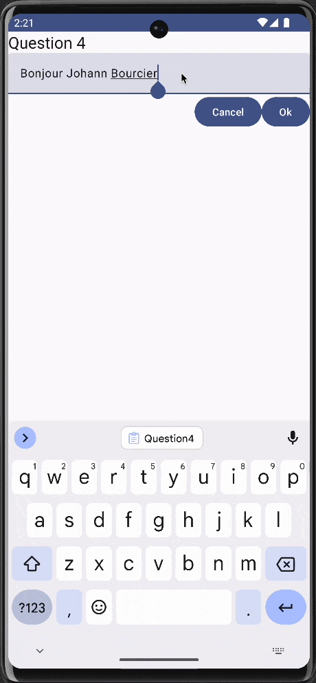
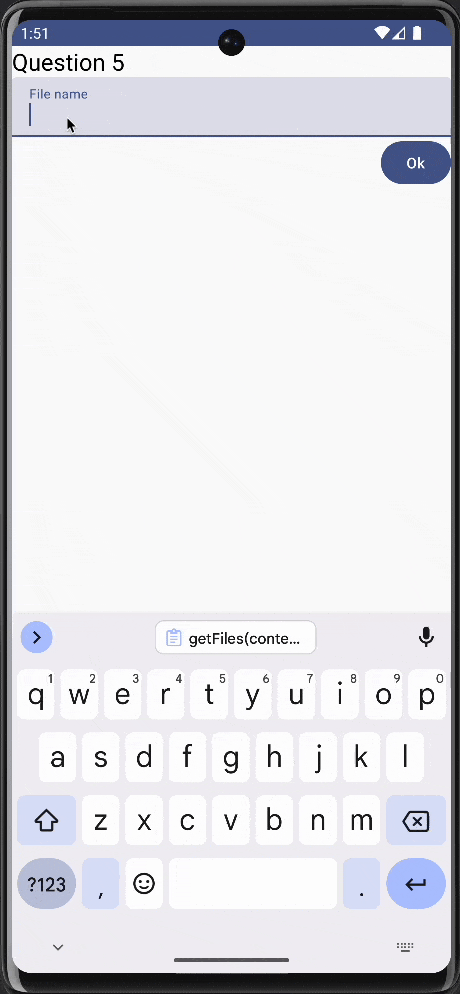

<h1 align="center">TP3 - Programmation mobile</h1>
<h4 align="center">Mael KERICHARD (@Pixselve) - Romain BRIEND (@Yami2200)</h4>
<p align="center">
   
   
   
</p>

Le projet est disponible sur [GitHub](TOOD).

# 1. Créer un fichier dans l’espace de stockage spécifique à votre application dont le nom correspond à la concaténation des noms de votre binôme.

On utilise une fonction intermédiaire qui permet de créer le fichier et d'écrire dedans.

```kotlin
/**
 * Saves a file with the given content and filename in the internal storage of the app.
 * @param content The text content to be written in the file.
 * @param filename The name of the file to be created or overwritten.
 * @param context The context of the app that calls this function.
 */
fun saveFile(content: String, filename: String, context: Context) {
    val file = File(
        context.filesDir,
        filename
    ) // Create a file object with the given filename in the app's internal storage directory.
    file.writeText(content) // Write the content to the file, overwriting any existing content.
}
```

Dans ce TP, nous avons fait le choix d'écrire dans le stockage interne et permanent de l'application.
Il était aussi possible d'écrire dans le stockage cache de l'application.

On a alors relié cette fonction à un bouton qui permet de sauvegarder le contenu du champ de texte dans un fichier.

# 2. Dans ce même fichier écrire une chaine de caractère “Bonjour [Nom de votre enseignant]”

C'est l'instruction `file.writeText(content)` qui permet d'écrire dans le fichier.

# 3. Réaliser une interface dans laquelle vous placerez un label qui affichera le texte contenu dans votre fichier.

On utilise une fonction intermédiaire qui permet de lire le contenu d'un fichier.

```kotlin
/**
 * This function takes a context and a filename as parameters and returns the content of the file as a string.
 * If the file does not exist, it returns "File not found" as a string.
 * @param context the context of the application
 * @param filename the name of the file to read
 * @return the content of the file or "File not found"
 */
fun fetchFileContent(context: Context, filename: String): String {
    val file = File(context.filesDir, filename)
    return if (file.exists()) {
        file.readText()
    } else {
        "File not found"
    }
}
```

On notera que si le fichier n'existe pas, on retourne "File not found". Si nous n'avions pas fait cela, l'application aurait planté.

<p align="center">
    
</p>


# 4. Démarrer d’une activité vide et réaliser une interface avec un champ texte editable et 2 boutons (“OK” et “Cancel”). Le champ texte doit être pré-rempli avec le texte contenu dans le fichier, le bouton “Ok” va écraser le contenu du fichier avec la valeur actuelle du champ texte et le bouton “cancel” écrase le contenu du champ texte avec la valeur contenu dans le fichier.

On utilise le même nom de fichier que précédemment.

Au démarrage du composant, on essaye de lire le contenu du fichier et on le stocke dans une variable mutable.

On relie le champ de texte à cette variable mutable. Ainsi, le champ de texte est pré-rempli avec le contenu du fichier.

Lorsque l'on clique sur le bouton "OK", on utilise la fonction `saveFile` pour écraser le contenu du fichier avec le contenu du champ de texte ie le contenu de la variable mutable.

Lorsque l'on clique sur le bouton "Cancel", on utilise la fonction `fetchFileContent` pour écraser le contenu de la variable mutable avec le contenu du fichier. Ainsi, le champ de texte est mis à jour.

<p align="center">
    
</p>


# 5. Démarrer d’une activité vide et créer une interface avec un champ texte editable et un bouton ok. Lorsque l’on appuie sur le bouton “ok”, votre application doit créer un fichier dans l’espace de stockage spécifique à votre application dont le nom correspond à la valeur du champ texte. Ne pas créer de fichier et afficher une alerte si le champ texte est vide.

Cette fois, on utilise un contenu de fichier fixe.

La variable mutable devient le nom du fichier.

Lorsque l'on clique sur le bouton "OK", on utilise la fonction `saveFile` avec le nom du fichier et le contenu fixe.

Avant d'appeler la fonction `saveFile`, on vérifie que le nom du fichier n'est pas vide.
Si c'est le cas, on affiche une alerte via un Toast.

# 6. Ajouter en dessous une listview qui affichera le nom de l’ensemble des fichiers contenu dans le répertoire spécifique de l’application

Pour récupérer la liste des fichiers, on utilise une fonction intermédiaire qui permet de lister les fichiers dans le répertoire de l'application.

```kotlin
/**
 * This function returns a list of the names of the files in the context's files directory.
 * If the directory is empty or does not exist, it returns an empty list.
 *
 * @param context the context of the application
 * @return a list of file names or an empty list
 */
fun getFiles(context: Context): List<String> {
    return context.filesDir.listFiles()?.map { it.name } ?: listOf()
}
```

Pour éviter les crashs, on retourne une liste vide si le répertoire n'existe pas ou est vide.

On utilise une `LazyColumn` pour afficher la liste des fichiers.

```kotlin
LazyColumn {
    items(files) { name ->
        Text(name)
    }
}
```

# 7. Pour chaque item de cette liste view ajouter un bouton “Supprimer” qui supprimera le fichier correspondant.

On ajoute une icône de corbeille à côté du nom du fichier. Lorsque l'on clique sur l'icône, on supprime le fichier.

Pour supprimer un fichier, on utilise la fonction `File(context.filesDir, name).delete()`.
Après avoir supprimé le fichier, on met à jour la liste des fichiers.

<p align="center">

</p>
